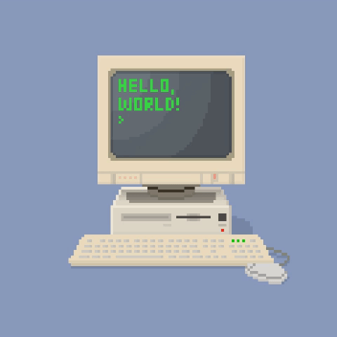

<h1 align = "center"> Ask Me Anything </h1>

 

<kbd><a href="../../issues/new">Ask a question</a></kbd> <kbd><a href="../../issues?q=is%3Aissue+is%3Aclosed">Read questions</a></kbd>

 
 
 
Occasionally I will ask myself questions. Think of it as a blog :)
